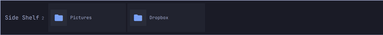

# Shelf

An Omarchy shell plugin (`sridhar.shelf`): a drop zone that slides out of a
screen edge. Throw files and folders at the edge to park them, click to open
them, drag them back out into whatever needs them later. Pin it to keep it
open. It lives on the right by default and moves to any of the four edges.

<video src="https://github.com/srikat/omarchy-shelf/raw/main/demo.mp4" width="900" controls muted playsinline></video>

The whole thing in two minutes: settings driven from the command line, the
shelf moved between screen edges, and at the end the gesture it exists for -
a folder dragged out of Files at the screen edge, the edge answering, the shelf
sliding out under the cursor, and the drop landing.
([demo.mp4](demo.mp4), 2m11s, 4K, no audio.)




## Using it

**Putting things on it.** Drag a file or folder from anywhere - Nautilus, a
browser, `dragon --and-exit` in a terminal - at the shelf's screen edge.
The edge lights up as an accent seam while a drag is over it, the shelf slides
out under the cursor, and dropping anywhere on it adds the file. Dropping on
the seam itself works too, so a throw that never quite makes it into the panel
still lands.

Only local paths are kept. A remote URL dragged out of a browser is ignored;
an image dragged out of one usually comes with a `text/uri-list` pointing at a
temp file, and that is what gets stored.

**Getting them back.** Click a row to open it with `gio open`, which unlike
`xdg-open` finds a terminal for handlers that need one - clicking a file whose
editor is nvim gets you nvim in a terminal, not a headless process you cannot
see. Press and drag a
row to take the file out into any other window - a real XDG drag carrying
`text/uri-list`, so upload forms, file managers and chat apps all take it. The
copy button puts it on the clipboard *as a file*, which is the fallback for
anywhere a drag does not land. Middle-click removes a row.

Dragging out is copy-only. The shelf never moves or deletes the file itself;
taking something off the shelf only forgets the path.

**Pin.** The pin in the header keeps the shelf open and reserves its strip, so
tiled windows shrink beside it instead of sitting underneath. Unpinned, it
slides away as soon as the pointer leaves. The pin survives a restart.

**How it opens.** By default, resting the pointer on its edge for a moment
brings it out. `omarchy-shelf reveal click` turns that off: the shelf then
stays shut until you click the little handle on the edge - the hairline pill
that marks where it lives. The handle is clickable in either mode, and grows
more visible when it is the only way in.

Clicking opens; it still slides away when the pointer leaves. Pin it if it
should stay.

**The handle.** That hairline pill on the edge is the only thing the shelf
draws while it is shut. `omarchy-shelf handle off` takes it away and leaves a
bare screen edge that still opens on a hover, a click or a drag - it hides the
marker, not the target. Turning it off *and* setting `reveal click` leaves an
invisible click target, which works but is only worth doing if you already know
where it is.

**Where it lives.** `omarchy-shelf position left|right|top|bottom` moves it, and
the choice is remembered.

Left and right are tall and narrow, and hold a vertical list of rows with each
file's parent directory under its name. Top and bottom are wide and short, and
hold the same list turned on its side: narrower chips, no parent directory,
because a 92px strip has room for one line of text and the file name is the one
that matters. The hot edge, the slide, the drop seam and the reserved strip all
follow the shelf around.

There is one shelf, on one monitor: it is a place to put things, and two of
them would be two different places. It takes the first monitor it is given and
stays there, and `omarchy-shelf monitor DP-1` moves it, naming the monitor the
way the compositor does. A name that is not connected yet is fine, which is how
you set the shelf up for a dock you are not currently at.

If the monitor it lives on goes away - unplugged, switched off, a DisplayPort
link dropped on the way out of sleep - the shelf moves to whatever screen is
left, and returns to its own the moment it is back.

Rows for files that have since been deleted or moved are struck through and
dimmed rather than removed, so a path on an unmounted drive does not quietly
vanish from the shelf.

## Keys

| Key | What |
| --- | --- |
| `SUPER + ALT + P` | Pin / unpin |

There is no toggle key by default: the shelf opens on its own when the pointer
rests on its edge or a drag arrives there. Add one in
`~/.config/hypr/bindings.lua` if you want it:

```lua
o.bind("SUPER + ALT + P", "Pin the shelf", "omarchy-shelf pin-toggle")
o.bind("SUPER + ALT + D", "Shelf", "omarchy-shelf toggle")
```

Pick a combo that is actually free. `SUPER + ALT + S` is the obvious guess and
is already the Omarchy default for moving a window to the scratchpad - and you
will not find that by reading your own `bindings.lua`, because the defaults
live in `/usr/share/omarchy/default/hypr/bindings/`. `hyprctl binds` is the
only view that shows both.

## Command line

`bin/omarchy-shelf` is a thin wrapper over the shell IPC. Put it on `PATH`:

```bash
ln -s ~/.config/omarchy/plugins/sridhar.shelf/bin/omarchy-shelf ~/.local/bin/
```

```bash
omarchy-shelf add ~/Downloads/report.pdf ~/Projects
omarchy-shelf add --quiet ./notes.md      # adds without sliding out
omarchy-shelf remove ~/Projects           # takes specific paths off
omarchy-shelf list
omarchy-shelf pin
omarchy-shelf position bottom             # left | right | top | bottom
omarchy-shelf position                    # prints the current edge
omarchy-shelf monitor DP-1                # move it to another monitor
omarchy-shelf monitor                     # prints the monitor it is on
omarchy-shelf reveal click                # only open on clicking the handle
omarchy-shelf reveal hover                # back to opening on a resting pointer
omarchy-shelf handle off                  # hide the pill on the edge
omarchy-shelf clear
```

Underneath it is shell IPC: `omarchy-shell shelf <method>`.

## Settings

All five are remembered in the state file rather than in `shell.json` -
the shell does not inject plugin settings into `service` plugins, and the shelf
already had a file to write.

| Setting | Default | Change it with |
| --- | --- | --- |
| `edge` | `right` | `omarchy-shelf position left\|right\|top\|bottom` |
| `pinned` | off | the pin button, `SUPER + ALT + P`, `omarchy-shelf pin` |
| `reveal` | `hover` | `omarchy-shelf reveal hover\|click` |
| `handle` | on | `omarchy-shelf handle on\|off` |
| `screen` | the first monitor it is given | `omarchy-shelf monitor NAME` |

`reveal: click` only stops a *resting pointer* from opening the shelf. Clicking
the handle, dragging a file at the edge, and `omarchy-shelf show` all still
work. Worth switching if you keep opening it by accident on the way to a
scrollbar or a window edge.

`reveal` was a `hoverReveal` boolean before it grew a second mode; a state file
written under the old name is still read, and `omarchy-shelf hover on|off`
still works.

State lives in `~/.local/state/omarchy/shelf.json`.

## Install

```bash
omarchy plugin add https://github.com/srikat/omarchy-shelf.git --enable --yes
```

Plugins run as unsandboxed code inside `omarchy-shell`, so `omarchy plugin add`
lands them disabled by default and asks you to review the code first. Drop
`--enable --yes` to take that path; it is four small files.

Update or remove it later with `omarchy plugin update sridhar.shelf` and
`omarchy plugin remove sridhar.shelf`.

## Requirements

Omarchy 4 (Quickshell 0.3, Qt 6.11) on Hyprland.

External dependencies, all of them already present on a stock Omarchy install:

| Command | Used for | Missing means |
| --- | --- | --- |
| `gio` (glib2) | opening a row | clicking a row does nothing |
| `wl-clipboard` (`wl-copy`) | the copy-as-a-file button | that button does nothing |
| `xdg-terminal-exec` | opening files whose handler is a terminal app | those files open headless, invisibly |
| `sh`, `mkdir`, `realpath` (coreutils) | the stat pass and the CLI | folders show as files |

Nothing is installed, no configuration is overwritten, and nothing runs with
elevated privileges. The plugin writes exactly one file,
`~/.local/state/omarchy/shelf.json`, and adds one symlink if you choose to put
`bin/omarchy-shelf` on your `PATH`.

Whether a drop even reaches the shelf is the compositor's call: it has to
deliver drags to layer-shell surfaces. Hyprland does.

## How it fits together

The plugin is a `service`, not a `panel`, because it has to already be on
screen when it is needed: the gesture starts by picking a file up in another
window, and you cannot summon a panel with a file in your hand. So one
layer-shell surface sits on a screen edge for the whole session and an input
mask keeps it out of the way - a few pixels of hot edge while closed, the panel
strip while open.

The surface is anchored to three sides - its own edge plus the two it runs
along - which leaves the fourth free for `implicitWidth`/`implicitHeight` to
mean thickness. Everything inside the closed state (the hot-edge pill, its
backing, the drop seam) is positioned with `x`/`y` rather than anchors: each
one has to flip axes with the edge, and anchoring two opposite sides *and* a
size is over-constrained.

That mask is the load-bearing part, and the reason there is no click-outside
dismissal overlay. A layer surface that claims the whole screen eats the mouse
press that *starts* a drag in the window underneath, which breaks dragging
files in no matter how well the `DropArea` works. Anything added here that
covers the screen breaks the shelf.

Three more things are worth knowing before touching the drag code, all learned
the hard way in [bylund.ledge](https://github.com/andreas-bylund/omarchy-ledge)
(MIT), whose `docs/drag-and-drop.md` is the reference for this on Hyprland:

- `Drag.mimeData` and `Drag.imageSource` only do anything when `dragType` is
  `Drag.Automatic`. A bare `Drag.active` toggle starts an internal-only drag
  that looks exactly like nothing happening.
- Qt refuses to start an automatic drag on an attached object that is not
  already active, and *warns* rather than throwing - so `beginDrag()` sets
  `active`, calls `startDrag()`, and clears it again.
- A drag needs a real Wayland input serial, so it must begin inside the mouse
  event that triggered it. Never from a timer or a shortcut.

`Drag.onDragFinished` reports `Qt.IgnoreAction` for every drag under Wayland.
Nothing here branches on it.

### Files

| File | What |
| --- | --- |
| `Service.qml` | the surface, the mask, state, persistence, IPC |
| `ShelfRow.qml` | one row: thumbnail, click-to-open, drag-out |
| `ShelfIconButton.qml` | header and row buttons |
| `ShelfModel.js` | pure helpers - paths, uris, icons, serialisation |
| `bin/omarchy-shelf` | CLI over the IPC target |

The plugin id, the IPC target and the CLI all say the same thing:
`sridhar.shelf`, `shelf`, `omarchy-shelf`. If something else on your system
already claims the `shelf` IPC target, change `IpcHandler.target` in
`Service.qml` and `IPC_TARGET` in `bin/omarchy-shelf` to match.

### Hacking on it

Work on a checkout rather than on the copy under `~/.config`, so edits land in
git. Fork or download the repository however you normally would, then point
Omarchy at that tree instead of letting it keep its own copy - from inside the
checkout:

```bash
ln -s "$PWD" ~/.config/omarchy/plugins/sridhar.shelf
omarchy-shell shell rescanPlugins && omarchy plugin enable sridhar.shelf
```

Installing normally with `omarchy plugin add` is the other way round: it keeps
its own clone under `~/.config/omarchy/plugins/`, which is the right thing for
using the plugin and the wrong thing for changing it.

### Debugging

```bash
journalctl --user -t omarchy-shell -f
```

QML edits under `~/.config/omarchy/plugins/` are supposed to hot-reload, but
plugin reloads do not reliably pick up changes to a `service` plugin's window.
Use `omarchy restart shell` after editing.

## Overlap with Ledge

`bylund.ledge` does the same job from the bar: a drop target on the bar icon
and a popup card under it. Shelf is the same idea against the screen edge
instead, with a pin. Running both is fine - they keep separate lists - but one
of them is probably redundant.

## Nothing here deletes your files

The shelf stores paths, not copies. Every way of taking something off it - the
delete button on a row, middle-clicking a row, "clear the shelf" in the header,
`omarchy-shelf remove`, `omarchy-shelf clear` - only forgets the path. The file
stays exactly where it was.

The panel says so too, rather than making you come here for it. The buttons are
labelled **Remove** and **Remove all**, never "delete" - the glyph is a trash
can, and the word next to it is the only thing that says otherwise at a glance.
Hovering either one also spells it out in the footer ("Take it off the shelf -
the file itself stays put"), the empty state states it up front, and the flash
afterwards confirms it.

Dragging a row out is copy-only for the same reason: the shelf offers the
receiving application `Qt.CopyAction` and nothing else, so even an app that
would happily move a file is not given the option. Nothing in this plugin ever
writes to, moves, or unlinks a file you put on it.

The one thing it will not do is notice on your behalf. If you delete or move a
file elsewhere, its row is struck through and dimmed rather than removed, so an
unmounted drive does not quietly empty your shelf.

## License

MIT. The path helpers, the Nerd Font glyph table and every hard-won fact about
Wayland drag and drop are adapted from
[bylund.ledge](https://github.com/andreas-bylund/omarchy-ledge) (MIT) - its
`docs/drag-and-drop.md` is the reference for this on Hyprland, and this plugin
would have been a lot more guesswork without it.
