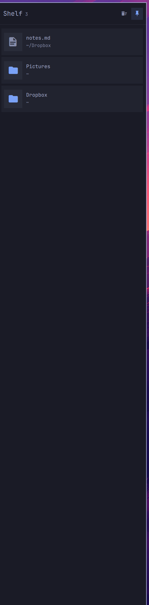

# Side Shelf

An Omarchy shell plugin (`sridhar.side-shelf`): a sliding drop zone on the
right screen edge. Throw files and folders at the edge to park them, click to
open them, drag them back out into whatever needs them later. Pin it to keep it
open.



## Using it

**Putting things on it.** Drag a file or folder from anywhere — Nautilus, a
browser, `dragon --and-exit` in a terminal — at the right edge of the screen.
The edge lights up as an accent seam while a drag is over it, the shelf slides
out under the cursor, and dropping anywhere on it adds the file. Dropping on
the seam itself works too, so a throw that never quite makes it into the panel
still lands.

Only local paths are kept. A remote URL dragged out of a browser is ignored;
an image dragged out of one usually comes with a `text/uri-list` pointing at a
temp file, and that is what gets stored.

**Getting them back.** Click a row to open it with `xdg-open`. Press and drag a
row to take the file out into any other window — a real XDG drag carrying
`text/uri-list`, so upload forms, file managers and chat apps all take it. The
copy button puts it on the clipboard *as a file*, which is the fallback for
anywhere a drag does not land. Middle-click removes a row.

Dragging out is copy-only. The shelf never moves or deletes the file itself;
taking something off the shelf only forgets the path.

**Pin.** The pin in the header keeps the shelf open and reserves its column, so
tiled windows shrink beside it instead of sitting underneath. Unpinned, it
slides away as soon as the pointer leaves. The pin survives a restart.

Rows for files that have since been deleted or moved are struck through and
dimmed rather than removed, so a path on an unmounted drive does not quietly
vanish from the shelf.

## Keys

| Key | What |
| --- | --- |
| `SUPER + ALT + P` | Pin / unpin |

There is no toggle key by default: the shelf opens on its own when the pointer
rests on the right edge or a drag arrives there. Add one in
`~/.config/hypr/bindings.lua` if you want it:

```lua
o.bind("SUPER + ALT + P", "Pin the shelf", "omarchy-shelf pin-toggle")
o.bind("SUPER + ALT + D", "Side Shelf", "omarchy-shelf toggle")
```

Pick a combo that is actually free. `SUPER + ALT + S` is the obvious guess and
is already the Omarchy default for moving a window to the scratchpad — and you
will not find that by reading your own `bindings.lua`, because the defaults
live in `/usr/share/omarchy/default/hypr/bindings/`. `hyprctl binds` is the
only view that shows both.

## Command line

`bin/omarchy-shelf` is a thin wrapper over the shell IPC. Put it on `PATH`:

```bash
ln -s ~/.config/omarchy/plugins/sridhar.side-shelf/bin/omarchy-shelf ~/.local/bin/
```

```bash
omarchy-shelf add ~/Downloads/report.pdf ~/Projects
omarchy-shelf add --quiet ./notes.md      # adds without sliding out
omarchy-shelf remove ~/Projects           # takes specific paths off
omarchy-shelf list
omarchy-shelf pin
omarchy-shelf hover off                   # stop the right edge opening on hover
omarchy-shelf clear
```

Underneath it is shell IPC: `omarchy-shell shelf <method>`.

## Settings

There are two, both remembered in the state file rather than in `shell.json` —
the shell does not inject plugin settings into `service` plugins, and the shelf
already had a file to write.

| Setting | Default | Change it with |
| --- | --- | --- |
| `pinned` | off | the pin button, `SUPER + ALT + P`, `omarchy-shelf pin` |
| `hoverReveal` | on | `omarchy-shelf hover off` |

Turning `hoverReveal` off leaves the drag-at-the-edge gesture and
`omarchy-shelf show` working; it only stops a resting pointer from opening the
shelf. Worth doing if you keep hitting it while reaching for a scrollbar.

State lives in `~/.local/state/omarchy/shelf.json`.

## Install

```bash
omarchy plugin add https://github.com/srikat/omarchy-side-shelf.git --enable --yes
```

Plugins run as unsandboxed code inside `omarchy-shell`, so `omarchy plugin add`
lands them disabled by default and asks you to review the code first. Drop
`--enable --yes` to take that path; it is four small files.

Update or remove it later with `omarchy plugin update sridhar.side-shelf` and
`omarchy plugin remove sridhar.side-shelf`.

## Requirements

Omarchy 4 (Quickshell 0.3, Qt 6.11) on Hyprland. `wl-copy` for the
copy-as-a-file fallback, `xdg-open` to open a row.

Whether a drop even reaches the shelf is the compositor's call: it has to
deliver drags to layer-shell surfaces. Hyprland does.

## How it fits together

The plugin is a `service`, not a `panel`, because it has to already be on
screen when it is needed: the gesture starts by picking a file up in another
window, and you cannot summon a panel with a file in your hand. So one
layer-shell surface sits on the right edge for the whole session and an input
mask keeps it out of the way — a few pixels of hot edge while closed, the panel
column while open.

That mask is the load-bearing part, and the reason there is no click-outside
dismissal overlay. A layer surface that claims the whole screen eats the mouse
press that *starts* a drag in the window underneath, which breaks dragging
files in no matter how well the `DropArea` works. Anything added here that
covers the screen breaks the shelf.

Three more things are worth knowing before touching the drag code, all learned
the hard way in [bylund.ledge](https://github.com/andreas-bylund/omarchy-ledge)
(MIT), whose `docs/drag-and-drop.md` is the reference for this on Hyprland:

- `Drag.mimeData` and `Drag.imageSource` only do anything when `dragType` is
  `Drag.Automatic`. A bare `Drag.active` toggle starts an internal-only drag
  that looks exactly like nothing happening.
- Qt refuses to start an automatic drag on an attached object that is not
  already active, and *warns* rather than throwing — so `beginDrag()` sets
  `active`, calls `startDrag()`, and clears it again.
- A drag needs a real Wayland input serial, so it must begin inside the mouse
  event that triggered it. Never from a timer or a shortcut.

`Drag.onDragFinished` reports `Qt.IgnoreAction` for every drag under Wayland.
Nothing here branches on it.

### Files

| File | What |
| --- | --- |
| `Service.qml` | the surface, the mask, state, persistence, IPC |
| `ShelfRow.qml` | one row: thumbnail, click-to-open, drag-out |
| `ShelfIconButton.qml` | header and row buttons |
| `ShelfModel.js` | pure helpers — paths, uris, icons, serialisation |
| `bin/omarchy-shelf` | CLI over the IPC target |

The plugin id and display name are `sridhar.side-shelf` / "Side Shelf", but the
IPC target and the CLI are the shorter `shelf` / `omarchy-shelf` —
`omarchy-side-shelf` is a lot to type at a prompt. If something else on your
system already claims the `shelf` IPC target, change `IpcHandler.target` in
`Service.qml` and `IPC_TARGET` in `bin/omarchy-shelf` to match.

### Hacking on it

Clone anywhere and symlink the checkout in, so edits land in the repo rather
than in `~/.config`:

```bash
git clone https://github.com/srikat/omarchy-side-shelf.git
ln -s "$PWD/omarchy-side-shelf" ~/.config/omarchy/plugins/sridhar.side-shelf
omarchy-shell shell rescanPlugins && omarchy plugin enable sridhar.side-shelf
```

### Debugging

```bash
journalctl --user -t omarchy-shell -f
```

QML edits under `~/.config/omarchy/plugins/` are supposed to hot-reload, but
plugin reloads do not reliably pick up changes to a `service` plugin's window.
Use `omarchy restart shell` after editing.

## Overlap with Ledge

`bylund.ledge` does the same job from the bar: a drop target on the bar icon
and a popup card under it. Side Shelf is the same idea against the screen edge
instead, with a pin. Running both is fine — they keep separate lists — but one
of them is probably redundant.

## Nothing here deletes your files

The shelf stores paths, not copies. Every way of taking something off it — the
delete button on a row, middle-clicking a row, "clear the shelf" in the header,
`omarchy-shelf remove`, `omarchy-shelf clear` — only forgets the path. The file
stays exactly where it was.

Dragging a row out is copy-only for the same reason: the shelf offers the
receiving application `Qt.CopyAction` and nothing else, so even an app that
would happily move a file is not given the option. Nothing in this plugin ever
writes to, moves, or unlinks a file you put on it.

The one thing it will not do is notice on your behalf. If you delete or move a
file elsewhere, its row is struck through and dimmed rather than removed, so an
unmounted drive does not quietly empty your shelf.

## License

MIT. The path helpers, the Nerd Font glyph table and every hard-won fact about
Wayland drag and drop are adapted from
[bylund.ledge](https://github.com/andreas-bylund/omarchy-ledge) (MIT) — its
`docs/drag-and-drop.md` is the reference for this on Hyprland, and this plugin
would have been a lot more guesswork without it.
